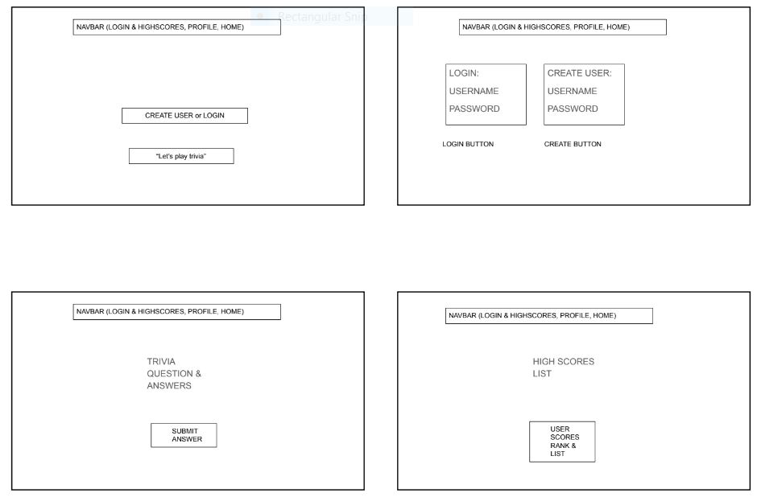

# Trivia Game

<ADD DEPLOYED link HERE>
Version 1.0
Deployment Date: February 2023

Contributors: Anita Banh, Magdalene Zernick, Erin Peifer, Michael Escamilla

# Description

Trivia Game is an application for entertainment. Test your knowledge of random facts! Answer questions and see how you rank on the scoreboard!
<ADD images of deployed application>

# Getting Started

Sign up for an account. Password must be at least 8 characters.

# Instructions

1. After the page landing page is loaded, click sign up if this is your first visit. Otherwise, (welcome back!)click login and enter your username and password.
3. See all your scores at the end of the game and from your Profile. 
4. Click "Play Again" from your Profile page to give it another try!
5. See how you compare to other players on the High Scores board.

# Built Using

Handlebars.js, Node.js, Express.js, MySQL, Sequelize, the-trivia-api.com

# Authors

* Magdalene Zernick: https://github.com/MZernick
* Anita Banh: https://github.com/AnitaBanh
* Erin Peifer: https://github.com/Airen22
* Michael Escamilla: https://github.com/mescamilla1114

# Original Idea

# IceBox

Ideas pending for possible future development:

1. Selectable trivia question categories (i.e. music, sports, history).
2. Scores & High Scores by category.
3. 

## License

Licensed under the MIT License - see the [LICENSE.md](https://github.com/MZernick/UTA-Trivia-Game/blob/main/LICENSE.md) file for details.
